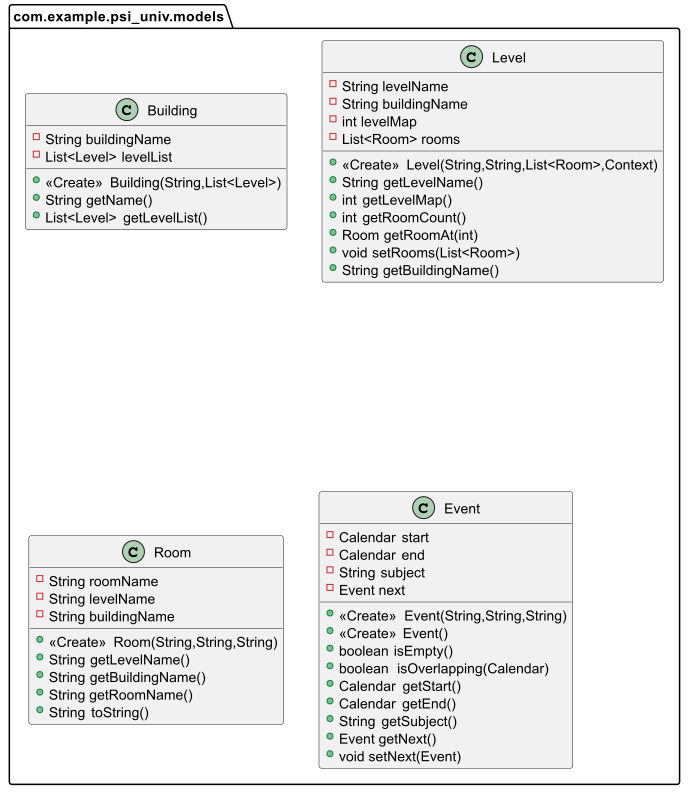
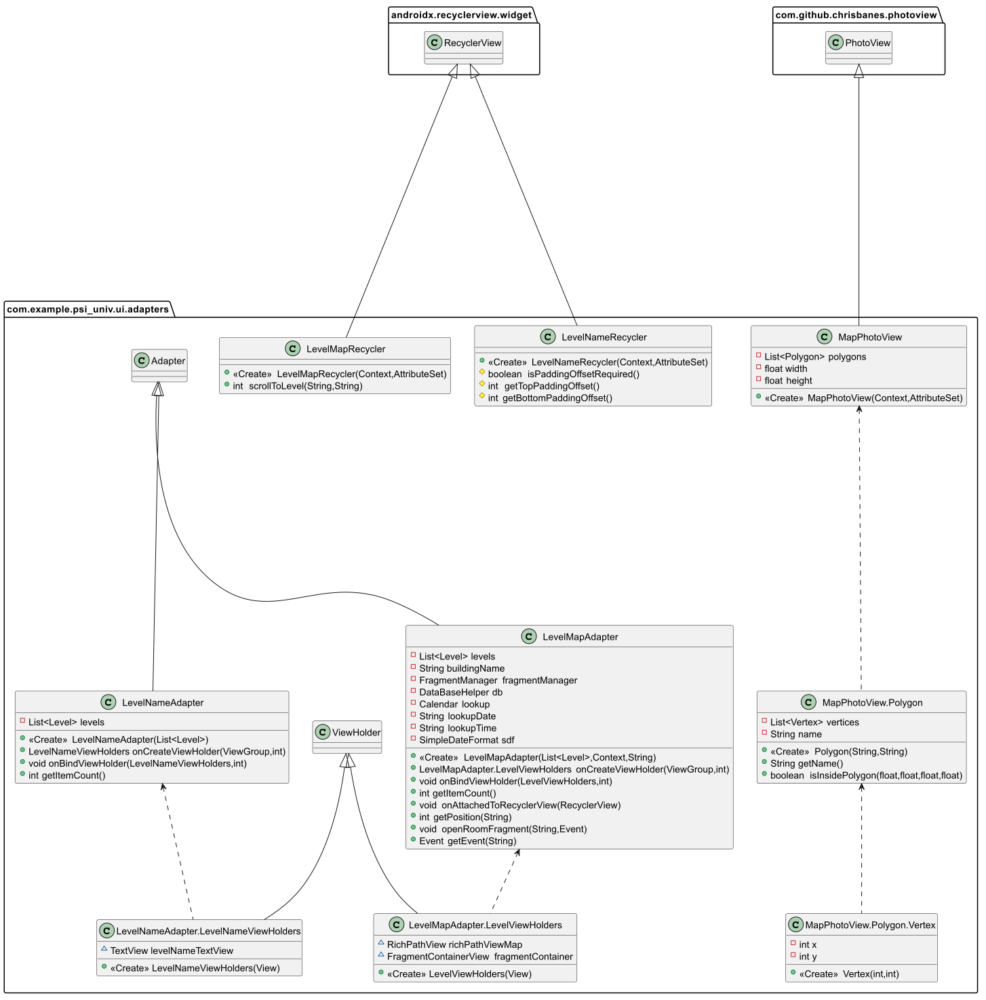
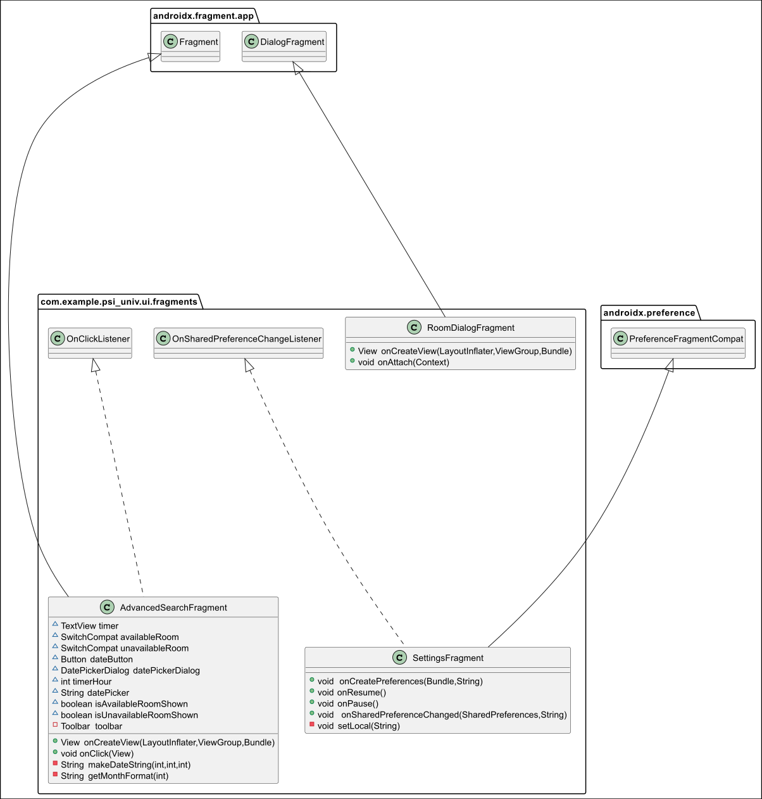

# Class Diagram

## Application

UML diagramm produce by [plantuml](https://plantuml.com/fr/)

### Models

- Building : Create and get the level,building's name. 
- Level : Set and create level for a specific room in a building
- Room : Create a room and get his name, level and name of his building
- Event : Create the event for the map and also the next event with the help of the calendar

### Activities

- AdvancedSearchActivity : User interface interaction for the advanced search (menu icon, back button, search bar, time picker, date picker and search button)
- MainActivity : User interface interaction for the main page (menu icon and search bar)
- SettingsActivity : User interface interaction for the settings page (menu icon, back button, language and date format)
- BuildingActivity : User interface for the map

### Adapters

- LevelMapAdapter : Display of the different level plan with interactive room
- LevelMapRecycler : Map scroll
- LevelNameAdapter : Name holder and adpater for the level
- LevelNameRecycler : Padding for the level name
- MapPhotoView.java : Display of the map 

### Backend

- Background : Get the Data and create the database in the background
- DataBaseHelper : Connexion with the online server to access the data for the application (timetable)

### Fragment

- AdvancedSearchFragment :  User interface interaction for the advanced search but was not used. The AdvancedSearchActivity was used instead
- RoomDialogFragment : Display of the room informations
- SettingsFragment : Store the user's preferences and visual modification when they are modified

## Database

UML diagramm produce by [Azure](https://azure.microsoft.com/fr-fr/)

- Rooms : All the rooms whith their floor, type, size, buildings and name
- Events : Timetable events in the database (event start and end, building, subject and name)
