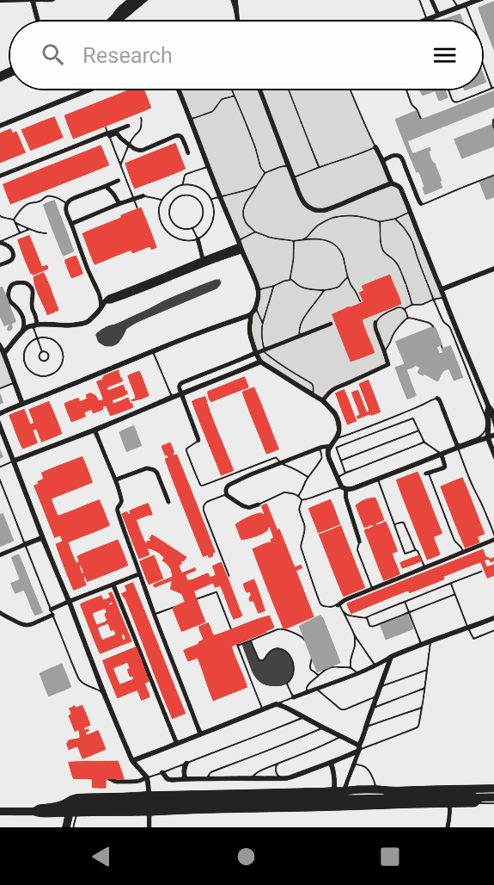

# PSI-Univ

(ENG) Android application that displays the rooms available on a campus plan based on the
university's schedule. This application would allow students to find available rooms faster.

(FR) Application android qui affiche les salles disponibles sur un plan du campus en se basant sur le
planning de la fac. Cette application permettrait aux élèves de trouver plus rapidement quelles
salles sont disponibles.

# Developed By

- Berrouche Issameddine 
- Buan Tony 
- Hamono Morvan 
- Vachez Guillaume 

# Libraries used

  - Android Studio (Java) (https://developer.android.com/studio)
  - AndroidX (https://developer.android.com/jetpack/androidx)
  - RichPath (https://github.com/tarek360/RichPath)
  - Material Design (https://material.io/)
  - PhotoView (https://github.com/Baseflow/PhotoView)
  - Jsoup (https://jsoup.org/download)
  - Play-services-maps (https://developers.google.com/android)
  - Core (https://developer.android.com/jetpack/androidx/releases/core)
  - Junit (https://mvnrepository.com/artifact/junit/junit/4.13.2)
  - Json (https://mvnrepository.com/artifact/com.googlecode.json-simple/json-simple/1.1.1)
  - Localization (https://github.com/akexorcist/Localization)
  
# Technologies used

  -Android Studio (java)
  -SQLite (https://www.sqlite.org/index.html) 
  -Github (https://github.com/)
   
# Features

  - All menu are availbale via the drawer menu (Hamburger icon or left to right swap)
  - Interactive map of the Rennes 1 University
  - Simplified plan of the buildings to know if a room is empty or not
  - Search bar to search a room/building directly
  - Advanced Search with date/time picker if you want to choose a precise time
  - Setting where you can select your prefered language (English or French) and your prefered date format

# TODO

- Language Change : updateConfiguration() is deprecated. Find another way to change the language of the app
- Extend coverage to every buildings in the Uiversity and not only the BD12
- More options (dark theme, more languages, ...)

# Licence

